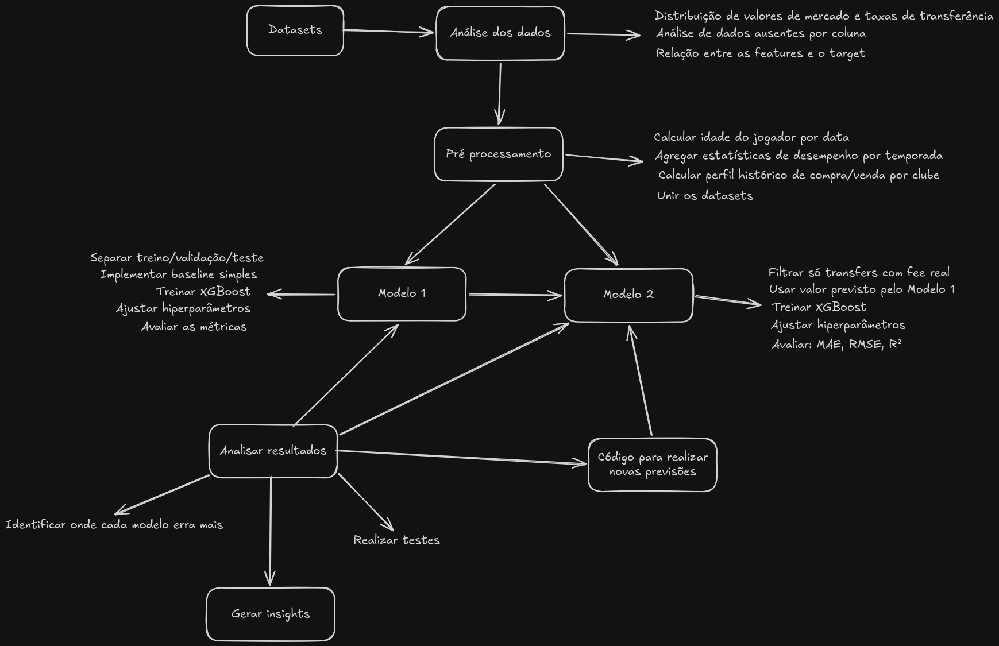

Proposta de Projeto Final Bootcamp de Aprendizado de Máquina - Lamia

  -----------------------------------------------------------------------
  **Título do          Previsão de Valor de Mercado e Estimativa de Preço
  Projeto:**           de Transferência
  -------------------- --------------------------------------------------
  **Nome do(a)         Felipe Fonseca
  Aluno(a):**          

  **Data da            Julho de 2026
  Proposta:**          
  -----------------------------------------------------------------------

+-------------------+--------------------------------------------------+
| **Resumo:**       | O projeto consiste em desenvolver dois modelos   |
|                   | de Machine Learning que trabalham em sequência   |
|                   | para responder uma pergunta prática do futebol:  |
|                   | quanto vale um jogador e, em uma negociação      |
|                   | específica, por quanto ele provavelmente seria   |
|                   | vendido?                                         |
|                   |                                                  |
|                   | O primeiro modelo prevê o valor de mercado de um |
|                   | jogador com base nos seus atributos físicos,     |
|                   | estatísticas de desempenho e o contexto do clube |
|                   | e liga onde atua. O segundo modelo usa esse      |
|                   | valor como ponto de partida e, combinando com o  |
|                   | histórico de negociação dos clubes envolvidos    |
|                   | (quanto cada clube costuma pagar acima ou abaixo |
|                   | do mercado), estima uma faixa de preço provável  |
|                   | de transferência. A principal entrega é um       |
|                   | pipeline funcional que, dado um jogador e dois   |
|                   | clubes, retorna o valor de mercado estimado do   |
|                   | jogador e a faixa de preço esperada para a       |
|                   | negociação.                                      |
+-------------------+--------------------------------------------------+
| **Objetivo        | Modelo 1: prever o valor de mercado de um        |
| Principal:**      | jogador em euros com erro médio abaixo de 20% do |
|                   | valor real, avaliado no conjunto de testes.      |
|                   |                                                  |
|                   | Modelo 2: dado um jogador e dois clubes          |
|                   | (comprador e vendedor), estimar a faixa de preço |
|                   | provável de transferência com erro médio abaixo  |
|                   | de 30% do valor real, avaliado no conjunto de    |
|                   | testes.                                          |
+-------------------+--------------------------------------------------+
| **Definição       | O mercado de transferências do futebol europeu   |
| Detalhada:**      | movimenta bilhões de euros por ano, mas os       |
|                   | preços reais de negociação muitas vezes não      |
|                   | correspondem ao valor de mercado estimado, e     |
|                   | esse desvio depende muito de quem está comprando |
|                   | e quem está vendendo. Um clube rico              |
|                   | historicamente paga acima do mercado; um clube   |
|                   | com problemas financeiros vende abaixo.          |
|                   |                                                  |
|                   | Eu escolhi esse problema porque é de um assunto  |
|                   | que eu gosto e me importo, que é realmente um    |
|                   | problema, não só no que diz respeito ao modelo   |
|                   | 2, mas também ao modelo 1, visto que o           |
|                   | transfermarkt realiza todas as precificações     |
|                   | através de avaliações da comunidade.             |
|                   |                                                  |
|                   | O projeto é relevante porque combina dois        |
|                   | problemas distintos de regressão num pipeline    |
|                   | coerente, usa dados que cobrem 26 anos de        |
|                   | histórico, e tem uma aplicação prática direta    |
|                   | para analistas de futebol, agentes de jogadores  |
|                   | ou clubes que precisam embasar negociações com   |
|                   | dados concretos.                                 |
+===================+==================================================+

+-------------------+----------------------------------------------------------------------------------------------------------------------------------------+
| **Fonte dos       | Os dados utilizados são públicos e foram extraídos do site Transfermarkt. Os datasets estão disponíveis no Kaggle:                     |
| Dados:**          |                                                                                                                                        |
|                   | Link: [[Football Data from                                                                                                             |
|                   | Transfermarkt]{.underline}](https://www.kaggle.com/datasets/davidcariboo/player-scores?resource=download&select=player_valuations.csv) |
+-------------------+----------------------------------------------------------------------------------------------------------------------------------------+
| **Informações dos | \[Tamanho aproximado do dataset (número de amostras, features), tipos de dados (numéricos, categóricos, imagens, texto), e qualquer    |
| Dados:**          | pré-processamento inicial planejado (ex: limpeza de missing values, normalização).\]                                                   |
|                   |                                                                                                                                        |
|                   | Serão utilizados mais de um dataset:                                                                                                   |
|                   |                                                                                                                                        |
|                   | - player_valuations;                                                                                                                   |
|                   |                                                                                                                                        |
|                   | - appearances;                                                                                                                         |
|                   |                                                                                                                                        |
|                   | - transfers;                                                                                                                           |
|                   |                                                                                                                                        |
|                   | - players;                                                                                                                             |
|                   |                                                                                                                                        |
|                   | - clubs;                                                                                                                               |
|                   |                                                                                                                                        |
|                   | - competitions.                                                                                                                        |
|                   |                                                                                                                                        |
|                   | Os dados variam entre dados numéricos, datas, e dados categóricos.                                                                     |
|                   |                                                                                                                                        |
|                   | Alguns pré processamentos planejados:                                                                                                  |
|                   |                                                                                                                                        |
|                   | - Calcular idade dos jogadores a partir da data de nascimento;                                                                         |
|                   |                                                                                                                                        |
|                   | - Agregar as aparições dos jogadores por temporada;                                                                                    |
|                   |                                                                                                                                        |
|                   | - Calcular o perfil histórico de compra e venda dos clubes (o quanto costuma comprar/vender em % acima/abaixo do valor estimado de     |
|                   |   mercado);                                                                                                                            |
|                   |                                                                                                                                        |
|                   | - Tratar valores ausentes (se tiverem);                                                                                                |
|                   |                                                                                                                                        |
|                   | - Corte de exemplos por clubes para avaliar o perfil de negociação (clubes sem exemplos suficientes de negociações utilizarão a média  |
|                   |   da liga como referência).                                                                                                            |
+===================+========================================================================================================================================+

+---------------------+--------------------------------------------------+
| **Domínio:**        | Regressão.                                       |
+---------------------+--------------------------------------------------+
| **Arquitetura(s):** | Será utilizado o XGBoost para ambos os modelos.  |
|                     |                                                  |
|                     | A justificativa é que o XGBoost treina muito     |
|                     | mais rápido e exige menos ajustes que uma rede   |
|                     | neural, além de ter melhor desempenho do que     |
|                     | redes neurais para dados tabulados como os que   |
|                     | serão utilizados, sendo melhor para evitar       |
|                     | overfitting.                                     |
+---------------------+--------------------------------------------------+
| **Métricas de       | MAE: métrica mais fácil de interpretar de forma  |
| Avaliação:**        | bruta (mostra o erro em euros)                   |
|                     |                                                  |
|                     | RMSE: penaliza os erros grandes, útil para       |
|                     | identificar se o modelo comete erros absurdos em |
|                     | casos mais extremos, como um jogador que vale    |
|                     | muito dinheiro ou um jogador sem valor.          |
|                     |                                                  |
|                     | R²: mede o quanto ele é bom de prever valores    |
|                     | que não estão próximos a média.                  |
+---------------------+--------------------------------------------------+
| **Ferramentas e     | Planejo utilizar: pandas, numpy, scikit-learn,   |
| Bibliotecas:**      | xgboost, matplotlib e talvez o seaborn.          |
+---------------------+--------------------------------------------------+
| **Possíveis         | Poucos exemplos com valor real da transferência  |
| Problemas:**        | em comparação a quantidade total das             |
|                     | transferências.                                  |
|                     |                                                  |
|                     | Clubes com pouco histórico de transferência.     |
|                     |                                                  |
|                     | Transferências absurdas que saem do perfil do    |
|                     | clube.                                           |
|                     +--------------------------------------------------+
|                     | 1- treinar o Modelo 2 somente com esses exemplos |
|                     | válidos e usar validação cruzada para garantir   |
|                     | que o modelo generaliza bem.                     |
|                     |                                                  |
|                     | 2- Definir uma quantidade mínima de exemplos     |
|                     | para calcular o perfil do clube, se não          |
|                     | alcançar, utiliza os valores da liga como        |
|                     | referência.                                      |
|                     |                                                  |
|                     | 3- Usar a mediana invés da média para calcular o |
|                     | perfil de compra, ou remover os registros        |
|                     | destoantes na hora de calcular a média.          |
+=====================+==================================================+

+-------------------+--------------------------------------------------+
| **Métricas a      | Modelo 1: MAE \< 20%, R² acima de 0.8            |
| serem             |                                                  |
| atingidas:**      | Modelo 2: MAE \< 30%, R² acima de 0.7            |
+-------------------+--------------------------------------------------+
| **Saídas do       | Os dois modelos treinados, gráficos de           |
| Projeto**         | visualização do modelo via matplotlib,           |
|                   | relatório, código no github.                     |
+===================+==================================================+

  -----------------------------------------------------------------------
  O problema é real e tem resultado verificável. O preço de transferência
  de um jogador é um dado público, que dá para medir com precisão o
  quanto o modelo errou em cada caso. Além disso, os dados têm volume
  suficiente. São mais de 656 mil registros históricos de valor de
  mercado cobrindo 26 anos, criados pelo transfermarkt, site de maior
  confiabilidade mundial quando o assunto é valor de mercado de um
  jogador. E ainda o pipeline vai conter dois modelos, onde o segundo
  modelo utiliza o primeiro em formato de cascata, e os dois têm uso
  real. Por fim, o tema é de grande alcance, pois muita gente acompanha
  futebol no mundo todo.
  -----------------------------------------------------------------------

  -----------------------------------------------------------------------

{width="6.267716535433071in"
height="4.055555555555555in"}
