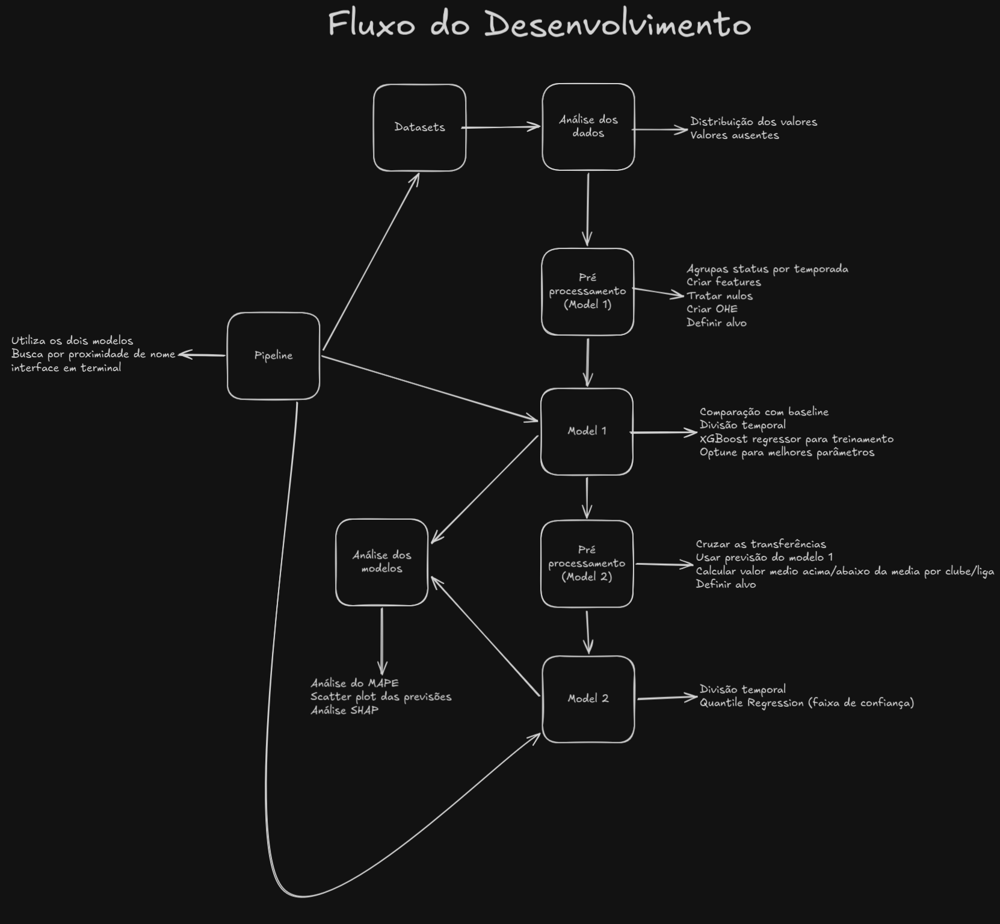
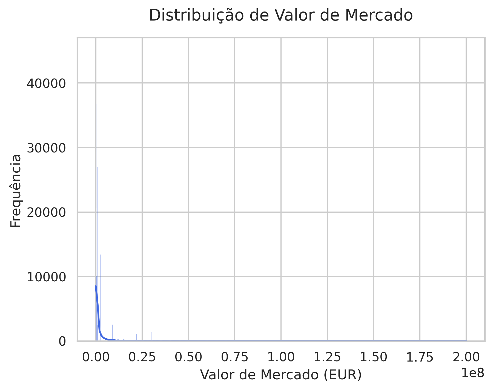
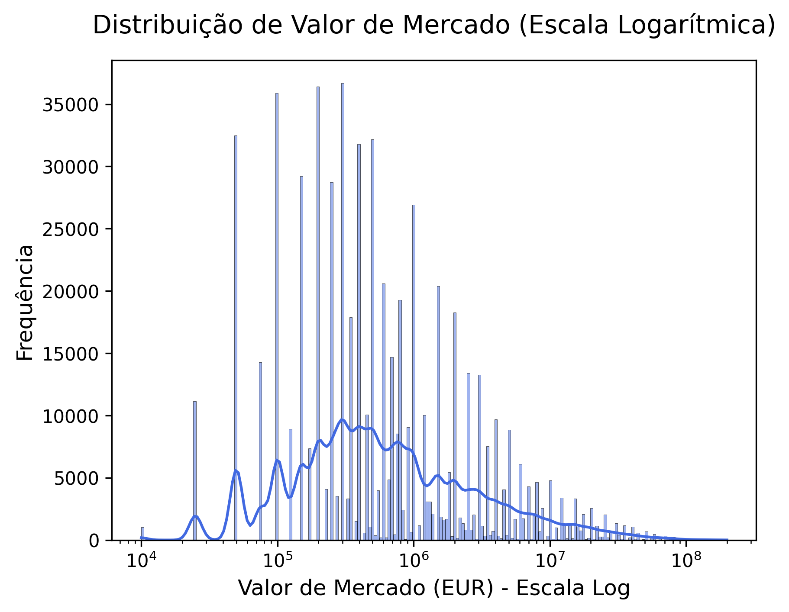
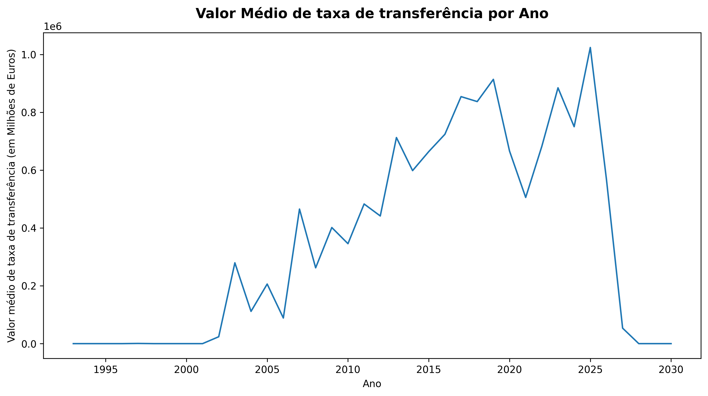
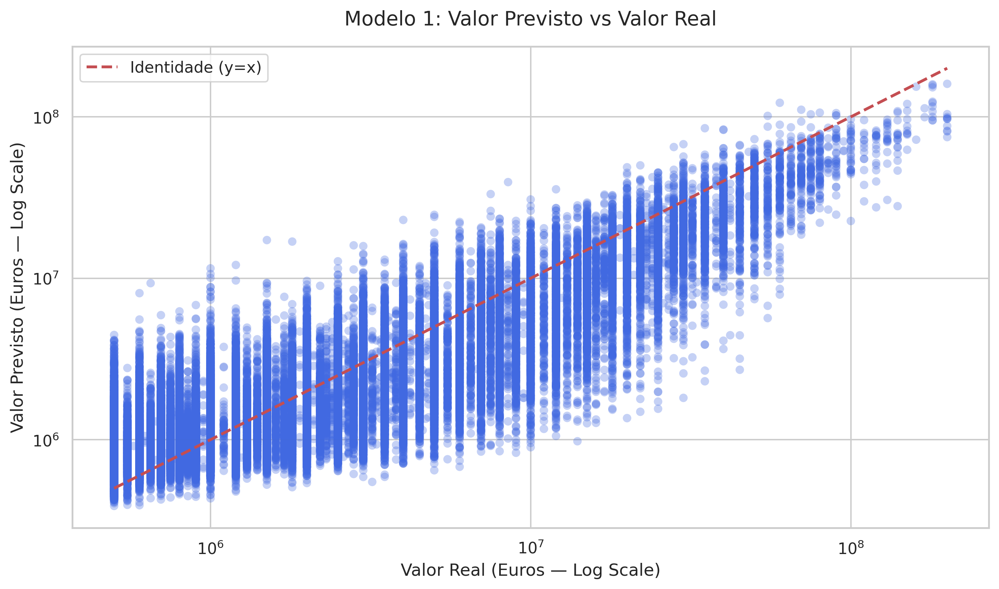
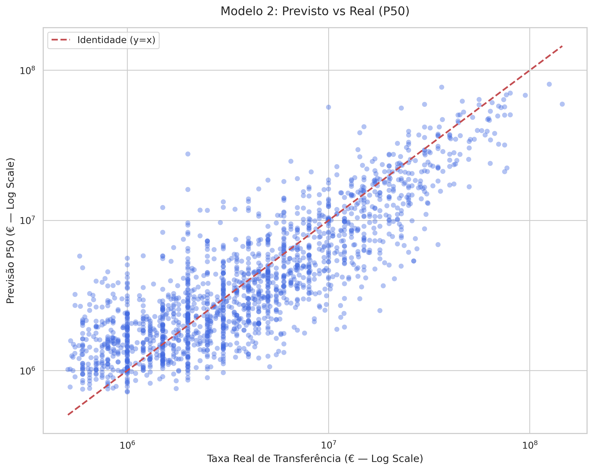
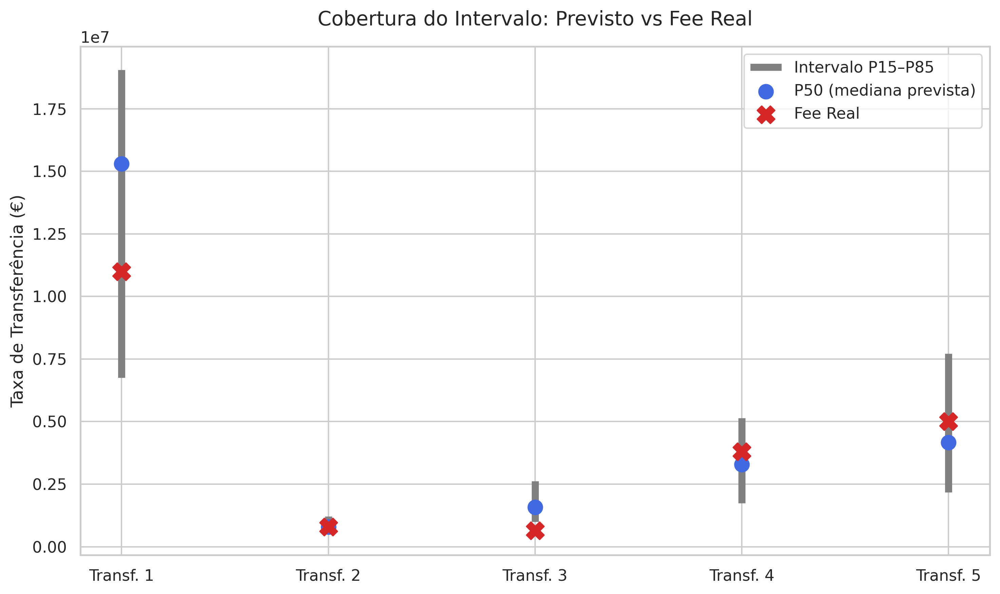
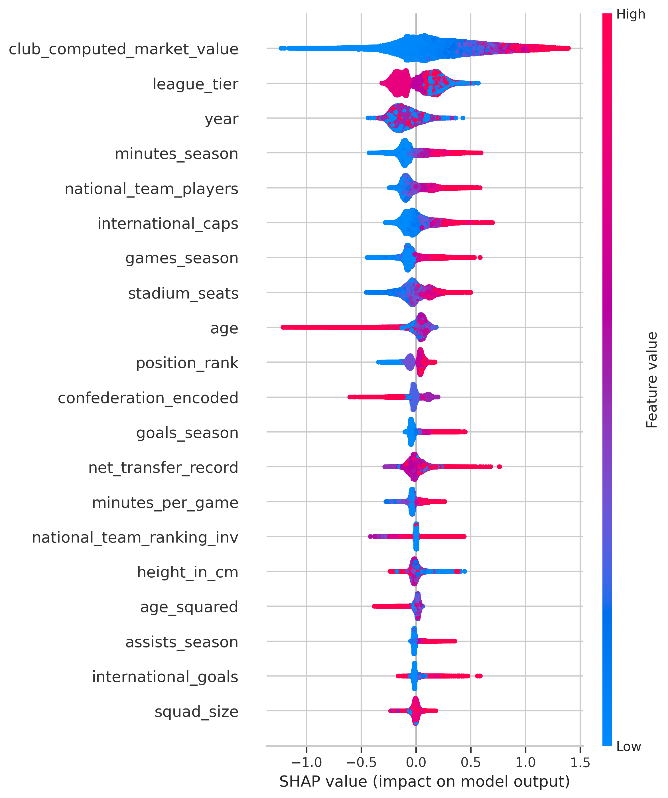
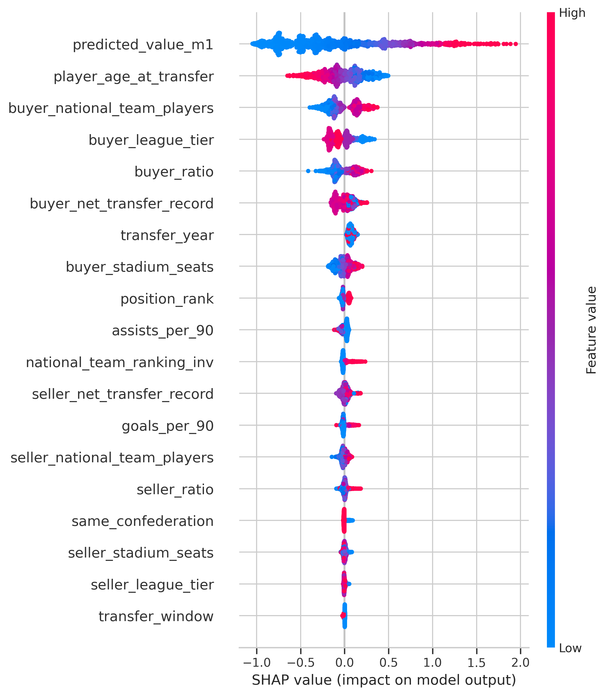
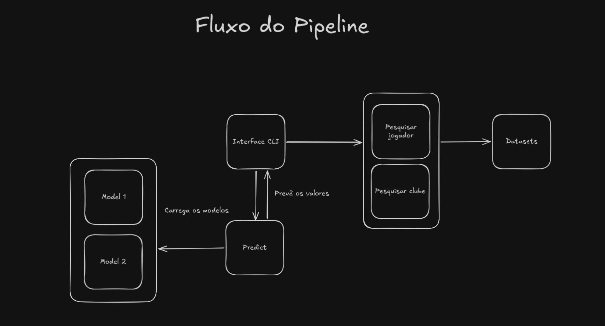

## 1. Introdução

Nesse projeto, eu decidi criar um modelo de machine learning para prever o valor de mercado de jogadores de futebol e também o valor das transferências entre clubes. A ideia era entender como diferentes fatores impactam no preço de um jogador e criar um intervalo de confiança para as negociações. Para isso, eu utilizei uma base de dados bem completa com informações de jogadores, clubes, aparições em jogos e histórico de transferências. O objetivo principal foi dividir o problema em duas etapas: primeiro, prever o valor de mercado justo do jogador usando suas características e desempenho; e depois, usar essa previsão junto com o histórico de gastos dos clubes para estimar a taxa de transferência real.

## 2. Desenvolvimento

### 2.1 Análise Exploratória dos Dados

A primeira coisa que eu fiz foi uma análise exploratória dos dados contidos nos diferentes datasets para entender a estrutura e os possíveis problemas que eu teria antes de iniciar qualquer processamento. A ideia era só dar uma olhada no que eu tinha e decidir o que precisa ser tratado.

Comecei analisando o dataset de Clubes e Jogadores. Para os clubes, eu verifiquei rapidamente a quantidade de equipes únicas e a presença de dados faltantes nas informações de ligas domésticas. Já para os jogadores, eu achei importante olhar as distribuições de posições no campo, nacionalidades e se havia algum valor inesperado no pé dominante. Notei também que há alguns valores nulos importantes, como a altura dos jogadores, o que ia me exigir um tratamento futuro.

Depois disso, eu fui analisar as Transferências e o Valor de Mercado. Eu fiz isso plotando alguns histogramas para entender a distribuição dos valores. Inicialmente eu fiz um plot na escala original, porém devido a forma como estavam os dados, tive que fazer na escala logarítmica, já que os preços variam de forma absurda (jogadores de custo zero e outros valendo centenas de milhões de euros). 

Algo que eu achei interessante foi agrupar os valores de transferências por ano, o que permitiu visualizar claramente como a média de valor de mercado e das taxas de transferência evoluiu ao longo do tempo. 

Além disso, eu criei um mapa de calor para cruzar a quantidade de registros por liga e ano, mas não achei tão útil.

Ao analisar as aparições, percebi algo que me chamou muita atenção. Eu filtrei as aparições do Lionel Messi em que ele marcou gols e o dataset retornou apenas 303 registros. Sinceramente, isso mostra que o dataset está incompleto, pois ele marcou gols em mais de 600 partidas, o que indica que não são todos os datasets do conjunto que cobriam dos anos 2000 até agora, esse por exemplo, começa em 2012 apenas, o que é menos tempo do que eu esperava. Isso é um ponto importante, ou seja, invés de confiar cegamente que eu tenho todos os dados do mundo do futebol, eu preciso estar ciente dessa limitação na hora de treinar e avaliar meus modelos.

### 2.2 Pré-processamento dos Dados

Depois eu foquei no pré-processamento dos dados para o primeiro modelo. O objetivo é transformar tudo que estava em texto ou quebrado em variáveis numéricas estruturadas, além de evitar qualquer tipo de data leakage, que foi uma das minhas dificuldades durante o projeto.

Primeiro, eu tratei as aparições dos jogadores. Eu achei mais útil agrupar as estatísticas por jogador e por temporada, invés de manter os dados granulares partida a partida. Isso resume o desempenho de forma que o modelo consiga entender a "fase" do jogador.

No dataset de clubes, eu me deparei com a coluna net_transfer_record no formato de string monetária, então tuve que criar uma função para converter isso tudo em números decimais reais. Além disso, eu criei uma classificação do nível da liga league_tier para indicar se o time está em uma liga de primeira divisão da Europa, segunda divisão, etc, afinal, a liga do jogador impacta diretamente no valor do de mercado, e para um modelo como o XGBoost que eu iria utilizar, fazer uma classificação ordinal é muito melhor do que um one hot encoder.

No caso dos jogadores, a primeira coisa que eu fiz foi remover colunas como market_value_in_eur e highest_market_value_in_eur, já que prever o valor é exatamente o objetivo final. Eu também preenchi a altura dos jogadores faltantes usando a mediana de altura para a respectiva posição no campo, visto que jogadores de defesa por exemplo costumam ser mais altos que meio campistas etc. Criei os OHE para pé dominante e sub-posições, pois nesse quesito eu não acho que seja tão impactante para o valor do jogador ainda, e também converti o ranking da FIFA das seleções para um ranking invertido, dando mais peso para o top 1, dessa forma, jogadores que representam seleções mais "pesadas" teriam maior valor.

Por fim, no script de Build Dataset, eu juntei tudo isso em um único dataframe. Um ponto importante aqui foi garantir que as estatísticas de aparições usadas para prever o valor de mercado fossem as da temporada anterior à data da avaliação, para não usar informações do futuro. Eu criei a coluna alvo log_market_value aplicando o logaritmo no valor de mercado, pois como visto na análise, a distribuição é muito assimétrica.

### 2.3 Treinamento do Modelo (Model 1)

Para o treinamento do primeiro modelo, comecei estabelecendo um baseline simples para ter um ponto de comparação, usando apenas a mediana dos valores agrupados por posição e nível da liga. 

Eu escolhi utilizar o XGBoost XGBRegressor porque ele lida muito bem com dados tabulares e tem suporte para uso de GPU (treinei algumas vezes no google colabs, até meu limite acabar). Antes de treinar, eu fiz a separação dos dados de treino, validação e teste. Um ponto muito importante aqui é que eu fiz uma divisão temporal (dados até 2021 para treino, 2022 a 2023 para validação e de 2024 em diante para teste).

Para encontrar os melhores hiperparâmetros, eu utilizei a biblioteca Optuna, que invés de testar combinações aleatoriamente, o Optuna aprende quais configurações funcionam melhor a cada tentativa. Para garantir que o modelo não tivesse overfitting, fiz a validação cruzada usando TimeSeriesSplit com 5 divisões, mantendo o respeito à linha do tempo dos dados a cada fold. Eu rodei 100 tentativas no Optuna e ele me devolveu um conjunto de parâmetros bem otimizado.

Por fim, eu treinei o modelo final com esses melhores parâmetros e comparei com o baseline. O modelo conseguiu uma melhoria significativa no MAPE (Erro Percentual Absoluto Médio) e um bom valor no R² (coeficiente de determinação), o que mostra que o modelo está realmente conseguindo capturar os padrões e prever os valores de forma muito mais inteligente do que a mediana. Sinceramente, fiquei bastante satisfeito com esse resultado e com a agilidade que a GPU proporcionou no processo. O modelo e as métricas foram todos salvos para o uso na predição final. Quanto ao MAPE, vale adicionar que eu não consegui alcançar os objetivos definidos por mim mesmo inicialmente, mesmo após vários treinamentos e uma análise nos dados, eu concluí que por conta da distribuição dos valores dos jogadores, seria muito difícil conseguir um valor bom para o MAPE, mesmo com o modelo sendo bom.

### 2.4 Pré-processamento dos Dados (Model 2)

Nesta etapa, eu precisei criar um segundo dataset para usar no modelo 2. O modelo 2 invés de usar o valor do jogador do transfermarkt, utiliza o valor previsto do modelo 1 para prever a taxa de transferência, e por isso precisei criar um segundo dataset.

A primeira coisa que eu fiz foi carregar o dataset de transferências e cruzar com os dados dos clubes para definir comprador e vendedor. Depois, eu utilizei o merge_asof para buscar as estatísticas exatas do jogador no momento imediatamente anterior à transferência, garantindo zero vazamento de dados do futuro. 

Com as características do jogador na época da venda, eu carreguei o modelo 1 e fiz com que ele previsse o valor de mercado do jogador naquela data exata. Essa previsão do modelo 1 virou uma feature no modelo 2.

Além disso, eu notei que alguns clubes têm o costume de pagar muito mais caro ou vender muito mais caro do que o valor de mercado padrão. Para capturar isso, criei métricas chamadas buyer_ratio e seller_ratio, que calculam a mediana histórica dos últimos 5 anos de quanto aquele clube (ou liga, em casos de clubes sem muita informação de transferências) costuma pagar a mais ou a menos em relação ao valor previsto pelo modelo 1.

Por fim, adicionei features sobre a transferência em si se foi na janela de inverno ou verão, idade exata no dia da transferência, se é a mesma confederação e criei a variável alvo log_transfer_fee.

### 2.5 Treinamento do Modelo (Model 2)

Aqui eu fiz o treinamento do modelo 2. Devido a dificuldade de prever o valor de uma transferência, invés de treinar o XGBoost com a função de perda tradicional que foca na média, eu mudei o objetivo para quantileerror, que é útil para prever intervalos invés de um valor exato. Na prática, foram treinados 3 modelos
- Um modelo para estimar 15%, que serve como o piso da negociação.
- Um modelo para estimar 50%, que é a mediana (o valor mais provável da venda).
- Um modelo para estimar 85%, que serve como o teto da negociação.

Antes de treinar esses três modelos, eu mantive a boa prática da divisão temporal (treino com dados antes de 2022 e teste com dados de 2022 em diante) e utilizei novamente o Optuna com TimeSeriesSplit para otimizar os hiperparâmetros, dessa vez focando no erro da mediana.

### 2.6 Avaliação dos modelos

Com os modelos treinados, fiz a avaliação deles. 

A primeira análise foi feita antes mesmo do modelo 2 ser treinado, foi quando eu estava tentando entender por que o modelo 1 não estava conseguindo atingir as métricas que eu tinha como meta no MAPE. Eu agrupei o dataset 1 por faixa de valor (ex: menos de 1 milhão, de 1 a 5 milhões, etc) e fiz uma previsão falsa, mas suficiente, utilizando o valor da avaliação passada do jogador como "previsão do próximo valor", e notei que o modelo erra muito mais nos jogadores muito baratos, pois qualquer diferença pequena em dinheiro representa uma porcentagem alta. Analisando o gráfico, seria necessário eliminar todos os jogadores com valor menor que 10 Milhões apenas para aumentar essa estatística do MAPE, apesar de que eu não imagino que isso vá realmente mudar no resultado do modelo em si, afinal o resultado do R² já estava suficiente, por isso, preferi deixar assim mesmo.

Após finalizar o treinamento dos dois modelos, a primeira coisa que eu fiz foi plotar um gráfico de dispersão scatter plot comparando o valor real da transferência com a previsão mediana. Como usamos escala logarítmica, os dados se alinham bem em torno da linha de identidade, o que mostra que o modelo consegue capturar a tendência geral dos preços.

Algo que eu achei extremamente útil foi avaliar a cobertura do intervalo de confiança. Eu plotei alguns exemplos aleatórios onde a linha vertical representava o intervalo e o X vermelho representava o preço real pago. Na maioria das vezes, o preço real cai dentro do intervalo previsto. 

Porém, eu fui investigar os outliers. então separei os casos em que o clube pagou mais que o dobro do nosso teto (P85) e os casos onde o jogador foi vendido por menos da metade do piso (P15). Analisando os nomes dos jogadores e os clubes envolvidos nesses casos, percebe-se que são negociações muito incomuns, tendo compras inflacionadas por clubes muito ricos ou vendas de jogadores que estavam com problemas internos com o clube.

Para entender a inteligência do modelo, eu fiz uma análise com o SHAP. Os gráficos de dependência mostraram claramente que a idade e o histórico de gastos do clube têm um impacto gigantesco na previsão do modelo 1, enquanto no modelo 2, o valor que teve mais impacto foi justamente o valor previsto pelo modelo 1.

### 2.7 Pipeline

Por fim, a última etapa do projeto foi fazer um script que utilizasse os 2 modelos para prever por quanto um jogador poderia ser vendido em uma negociação entre dois clubes.

O primeiro foi o predict.py, onde eu criei a classe TransferPredictor. Esse script carrega os modelos salvos, lida com as features necessárias e usa a biblioteca rapidfuzz para permitir buscas aproximadas pelos nomes dos jogadores e clubes. Depois, fiz uma cli utilizando a biblioteca rich para desenhar os menus e fazer uma interface básica. O fluxo de execução passa por escolher o jogador, o clube que tem a posse dele para vender e quem vai comprar, ou então simplesmente calcular o valor do jogador.

Testando com alguns jogadores, eu vi que para acertar o valor do jogador, o modelo está muito bom. Na vida real, vários outros fatores são levados em consideração, como por exemplo até o impacto de mídia que o jogador tem, mas no modelo não tem como isso ser avaliado, esse ponto, ao ser analisado por um lado, é ruim porque não consegue pegar o valor original do transfermarket. Mas a plataforma não é a fonte da verdade, ela serve apenas como base, se olhado por outro ponto de vista, esse modelo pode ser considerado até melhor, pois foca apenas no desempenho do jogador, e não em fatores externos. "Futebolisticamente" falando, o valor proposto no modelo pode até ser mais útil que o do transfermarkt.

Quanto ao modelo 2, algumas previsões ficaram com valores realmente muito abaixo do valor do jogador previsto pelo próprio modelo, como uma previsão que eu fiz do Vinicius Junior sendo vendido do real madrid para o manchester city. Mas se for analisar os fatos, o real madrid é um clube que não precisa de dinheiro, sempre que ele vende seus jogadores, são por conflitos, foi assim até com o Cristiano Ronaldo, Sergio Ramos e outros ídolos, o que acabou causando uma venda deles por valor muito abaixo. Se analisar por esse lado, até mesmo esse modelo 2 pode ter um bom resultado.

## 3. Conclusão

Nesse projeto eu consegui colocar em prática todo o fluxo de desenvolvimento de um modelo de machine learning, passando pela análise dos dados, pré-processamento, otimização de hiperparâmetros e criação de um pipeline final. Foi muito interessante ver como o uso de dois modelos sequenciais, onde o primeiro alimenta o segundo, funciona na prática para resolver um problema mais complexo. Algo que eu achei extremamente útil foi a mudança da função de perda no modelo 2 para prever os quantis invés de focar na média. Isso me permitiu criar intervalos de confiança para as transferências, o que faz muito mais sentido no mundo do futebol, já que o preço de uma venda raramente é um número exato e depende muito do momento do mercado e do poder de compra dos times. Porém, eu enfrentei algumas dificuldades, principalmente em relação ao vazamento de dados temporais, e ao entender por que algumas estatísticas estavam indo bem enquanto o MAPE estava distante. Apesar do modelo não acertar tudo perfeitamente, já que fatores externos como mídia afetam muito na vida real, eu estou satisfeito com os resultados obtidos.

## 4. Referências

- [Kaggle](https://www.kaggle.com/datasets/davidcariboo/player-scores?resource=download&select=player_valuations.csv)
- [Transfermarkt](https://www.transfermarkt.com/)
- [XGBoost](https://xgboost.readthedocs.io/en/stable/)
- [Optuna](https://optuna.org/)
- [TimeSeriesSplit](https://scikit-learn.org/stable/modules/generated/sklearn.model_selection.TimeSeriesSplit.html)
- [MAPE](https://en.wikipedia.org/wiki/Mean_absolute_percentage_error)